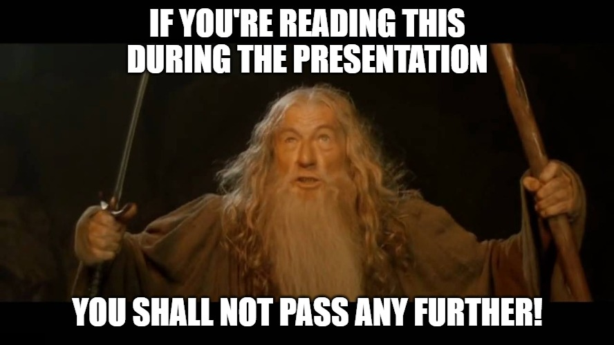

# ReactJS Workshop for NTNU

## Prerequisites

### GIT

Git is a source control tool used to track changes across projects of any size. For installation instructions see: https://git-scm.com/

### NodeJS

NodeJS is a JavaScript runtime built on top of Google Chrome's javascript engine called V8. For installation instructions go to: https://nodejs.org/en/

### Text editor

You can use whatever text editor you prefer. During the live-coding session we're going to use Visual Studio Code. You can download it here: https://code.visualstudio.com/

## How to start

First you will need to clone this repository with git. On your Mac or PC open terminal, navigate to your favourite project folder and run the following command:

```shell
git clone https://github.com/TeliaSoneraNorge/ntnu-react-workshop.git
```

This command will create a new directory called ntnu-react-workshop. Using `cd` command navigate inside that directory.

```shell
cd ntnu-react-workshop
```

After that run the following command in order to install all required javascript dependencies.

```shell
npm install
```

Once all of the dependencies are installed you can start your project with this command:

```
npm start
```

It will run a development web server on your local computer which you can access by typing `http://localhost:1234` in your browser.

If you followed all these steps correctly you should see a warm welcome from the page you just opened.



Because spoilers ahead.

## Part 1: Dealing with the basics

In the first part we'll have a look on how to create a React component. We will try to create a simple list of articles with heading, tags and some content.

The complete version of the source code can be seen by switching to the `1-basic` branch by running `git checkout 1-basic` in your terminal.

## Part 2: Rendering in style

Most of the time we try to reuse existing code to speed up our development process. In this second part we will use Telia's styleguide to style our list of articles by reusing already existing components.

The styleguide can be accessed on this URL: http://styleguide.channelapi.telia.no/storybook

The complete version of the source code can be seen by switching to the `2-with-component-lib` branch by running `git checkout 2-with-component-lib` in your terminal.

## Part 3: Getting more interactive

Wondering why the buttons we added in the last part don't do anything? Well wonder no more! Because in this part we're going to have a look at callback functions and how we can make our little react application more interactive.

The complete version of the source code can be seen by switching to the `3-interactive` branch by running `git checkout 3-interactive` in your terminal.

## Part 4: Fetching data

Part of any data driven application are.. well.. data. In this part we're going to fetch some articles from a remote source on the internet.

The complete version of the source code can be seen by switching to the `4-data-fetching` branch by running `git checkout 4-data-fetching` in your terminal.

Our data will be fetched from the following URL: `http://workshop-blog.s3-website-eu-west-1.amazonaws.com/blog/{page}.json`

## Part 5: Fetching more data in a more interactive way

In this final part we're going to have a look how we can do a simple paging with the list of articles we made in previous parts.

We will use the same API URL from 4th part.

The complete version of the source code can be seen by switching to the `5-paging` branch by running `git checkout 5-paging` in your terminal.

# Slides

The slides presented during the workshop are accessible here: https://teliasoneranorge.github.io/ntnu-react-workshop/
